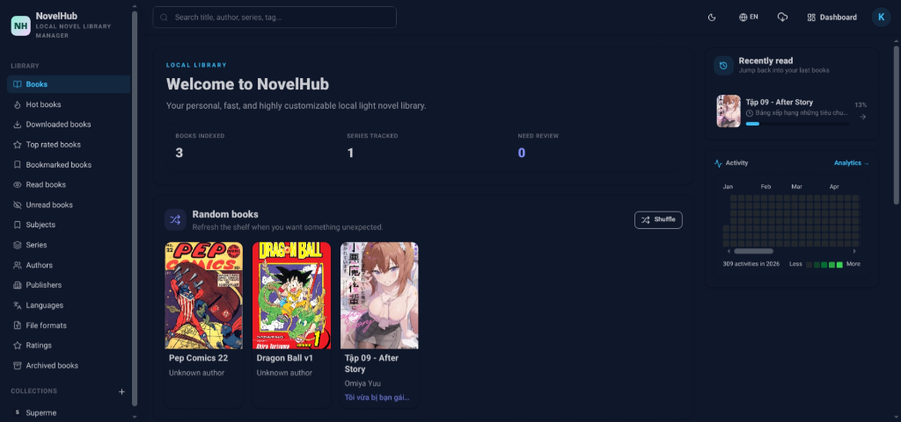
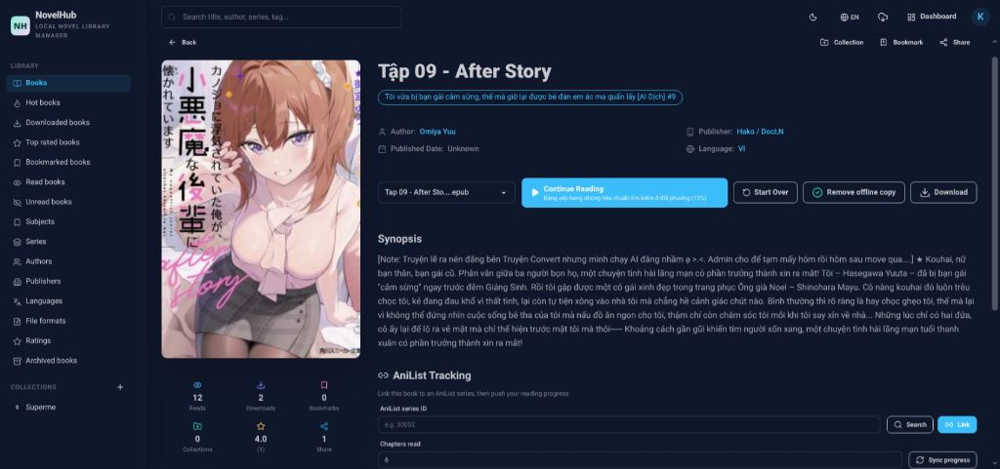
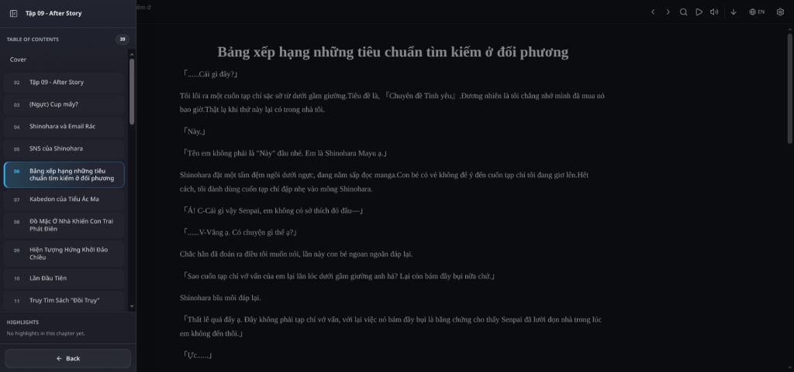
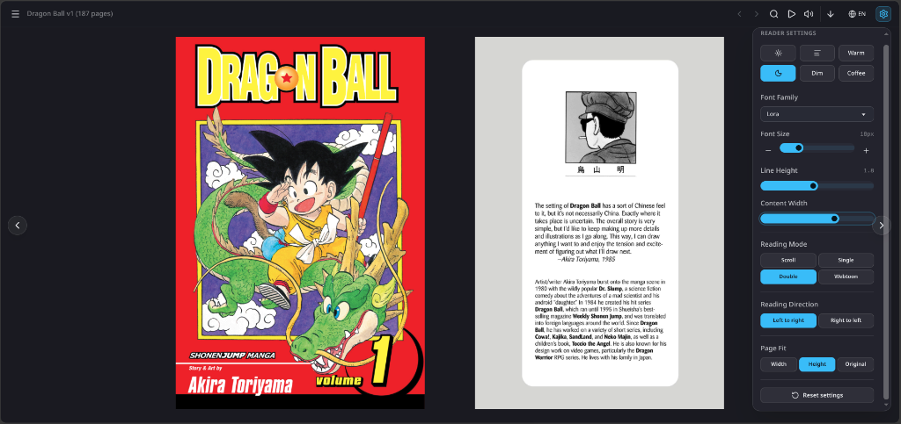
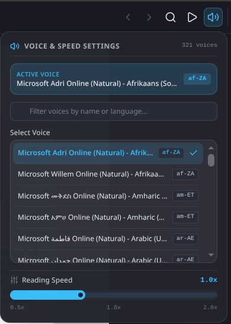

# NovelHub

<p align="center">
  
</p>

Self-hosted, local-first digital book library manager. Organize, read, and manage your entire digital book collection — EPUB, MOBI, PDF, DOCX, FB2, and more — from a single, high-performance web interface.

**Docs:** [English](docs/en/configuration.md) · [Tiếng Việt](docs/vi/configuration.md) · [日本語](docs/ja/configuration.md) · [한국어](docs/ko/configuration.md) · [简体中文](docs/zh/configuration.md)

---

## Features

### 📖 Reading Experience
- **Multi-Format Reader**: Render EPUB, PDF, MOBI, AZW, DOCX, FB2, Comic CBZ/CBR, TXT, MD, HTML natively
- **eBook Converter**: Built-in pure-Go converter between EPUB, MOBI, KePub, PDF, DOCX, FB2, CBZ, TXT formats
- **Text-to-Speech (TTS)**: Multi-voice reader with speech speed control and active word highlighting
- **PWA & Offline Reading**: Progressive Web App with browser-level IndexedDB storage for offline reading
- **Custom CSS & Fonts**: Support for user-defined CSS styles and custom font file uploads
- **Highlights & Notes**: Text selection highlights, inline annotations, and Readwise export
- **Book Archival**: Archive books to hide them from the main bookshelves without deleting files

### 🎧 Audio & Podcast Support
- **Native Audio Streaming**: Play MP3, M4A, M4B, and FLAC files without FFmpeg or HLS dependencies
- **Audiobook Merger**: Combine multiple audio tracks into a chaptered M4B audiobook natively
- **ASIN Chapter Lookup**: Automatic audiobook chapter metadata lookup via Audnexus API
- **Podcast Manager**: Subscribe to RSS XML feeds, auto-refresh feeds, and download episodes as books

### 📱 Integrations & Sync
- **Kobo Wi-Fi Sync**: Sync library, bookmarks, reading progress, and KePub conversion over Wi-Fi
- **Mihon / Tachiyomi Sync**: Komga-compatible REST API for comic reading progress sync
- **VBook Android Integration**: Built-in plugin registry API and downloadable ZIP package for VBook
- **OPDS 1.2 & 2.0 Server**: Server-wide OPDS catalogs for KOReader, Moon+ Reader, Thorium, etc.
- **Tracker Scrobbling**: Two-way progress sync with AniList, MyAnimeList, and Hardcover.app
- **Readwise Export**: Direct highlights sync to Readwise (plus Markdown exports)
- **Send-to-Kindle**: E-mail delivery of eBooks via secure SMTP with attachment size control

### 🔍 Discovery & Organization
- **Advanced Faceted Search**: Multi-facet filtering by authors, publishers, languages, formats, tags, series, and ratings
- **Deep Full-Text Search**: Unicode FTS5 search across all chapter contents of all books
- **Smart Filters & Collections**: Create rule-based dynamic shelves pinned to home or sidebar
- **Private Read Lists**: Sequenced reading lists with CBL (ComicRack) file importing
- **Fuzzy Duplicate Management**: Jaro-Winkler/Dice duplicate detection and file merging tool
- **Calibre Import**: Full library metadata import from Calibre's `metadata.db`

### 📊 Analytics & Engagement
- **Reading Analytics Dashboard**: Personal heatmaps, sessions, daily/annual goals, and library breakdowns
- **Estimated Reading Time (ETA)**: Accurate reading speed calculations per book
- **Book Reviews & Ratings**: User-written reviews, stars, and shareable public links

### 🔒 Security & Access
- **PIN-Protected Kids Mode**: Toggle visibility of mature books based on G/PG/R/R18 ratings
- **Magic Code Login**: 6-digit passwordless login for e-readers and smart devices
- **Granular RBAC**: Role-based access control with 39 precise permissions
- **SSRF & Path Traversal Prevention**: Socket-level network and file path hardening

### ⚙️ Operations & Architecture
- **Single Binary Deployment**: Frontend and SQLite WAL schema compiled into a single file
- **Zero-Downtime Backups**: SQLite online snapshots and staged integrity-verified restores
- **Job Scheduler**: Queue engine with cron-like task schedulers
- **Admin System Logs**: Live tail log viewer with rotating log files
- **First-Run Setup Wizard**: Intuitive administrator setup and logo/favicon cropper
- **Multi-Language UI**: i18n support for 16 languages

---

## Screenshots

<p align="center">
  
  
</p>
<p align="center">
  
  
</p>
<p align="center">
  
</p>

---

## Quick Start

### Docker

```bash
cp .env.example .env
openssl rand -hex 32   # three times — one per secret in .env
docker compose up -d
```

### Run Locally

```bash
cp .env.example .env
make run
```

Open `http://127.0.0.1:3434`. The Setup Wizard (`/setup`) runs on first launch
and creates the root administrator.

Behind a reverse proxy, add `TRUST_PROXY=true` to `.env` and forward
`X-Forwarded-For` and `X-Forwarded-Proto` — see
[Reverse Proxy](docs/en/reverse-proxy.md). The compose file already defaults it to
`true`; set `TRUST_PROXY=false` if you publish the port straight to the internet
with no proxy in front, or clients can forge those headers.

---

## Development

```bash
# Frontend dev (port 5173 with Bun)
cd web && bun install && bun run dev

# Backend dev
go run ./cmd/api
```

### Make Targets

| Target | Description |
|---|---|
| `make run` | Build frontend with Bun and start Go server |
| `make test` | Run all Go unit tests |
| `make sqlc` | Regenerate SQLC database models |
| `make check` | Run full verification (sqlc + tests + web-build + go build) |

---

## Project Structure

```
novelhub/
├── AGENTS.md            # Architecture rules for AI coding agents
├── cmd/api/             # Application entry point & embedded web UI
├── internal/
│   ├── controllers/     # Fiber v3 HTTP handlers & DTO validation
│   ├── dtos/            # Request / Response payload definitions
│   ├── gen/sqlc/        # Type-safe generated database code
│   ├── middlewares/     # JWT auth, RBAC permissions, rate limit, body limit
│   ├── models/          # Domain entities (FromSqlc / ToResponse helpers)
│   ├── repositories/    # Persistence layer with RAM Cache-by-IDs pattern
│   ├── routes/          # Route registration & per-route middleware wiring
│   └── services/        # Domain business logic & multi-format parsers
├── pkg/
│   ├── apperrors/       # Application error definitions
│   ├── bookparser/      # Format parser engines (EPUB, MOBI, PDF, FB2, etc.)
│   ├── cache/           # In-memory RAM cache (`theine-go`) & key builders
│   ├── calibre/         # Calibre metadata.db import engine
│   ├── config/          # Environment variable access with defaults
│   ├── constants/       # Cache keys, TTLs, limits, permission constants
│   ├── convert/         # ID parsing, null conversion & cursor helpers
│   ├── crypto/          # AES-256-GCM encryption for stored credentials
│   ├── database/        # SQLite pragmas, schema apply & TxManager
│   ├── jsonx/           # High-performance JSON engine (sonic with std fallback)
│   ├── kepub/           # EPUB to KePub conversion for Kobo devices
│   ├── kobo/            # Kobo sync protocol types & constants
│   ├── localfs/         # Path traversal prevention using SafeJoin & filepath.Rel
│   ├── logging/         # Structured logging with file rotation
│   ├── mailer/          # SMTP delivery with STARTTLS / implicit TLS
│   ├── netx/            # SSRF-safe HTTP client with IP validation
│   ├── opds/            # OPDS 1.2 / 2.0 feed types
│   ├── systemgate/      # Startup gating for staged database restores
│   ├── totp/            # TOTP two-factor authentication
│   ├── validator/       # DTO struct validation engine
│   └── worker/          # Bounded background worker pool
├── db/
│   ├── embed.go         # //go:embed schema/*.sql — schema ships in the binary
│   ├── schema/          # SQLite schema, applied on first launch
│   └── query/           # Type-safe SQLC query definitions (explicit column projections)
└── web/                 # React 19 + Vite + TailwindCSS + DaisyUI (Bun)
    ├── public/locales/  # i18n translation datasets (en, vi, ja, ko, zh-CN, zh-TW, es, fr, de, pt, ru, ar, hi, id, th, it)
    └── src/             # Components, Pages, Services, Stores (Zustand)
```

The project is not yet public, so `db/schema/` carries no migration history: schema files are
edited in place and the database is recreated. Because the schema is embedded at compile time,
a missing schema file is a build error rather than a runtime failure on someone else's machine.

---

## Configuration

Four environment variables matter — three secrets and one proxy setting.
Everything else auto-tunes or is configured in the admin UI.

```bash
cp .env.example .env
openssl rand -hex 32   # run three times, one per secret
```

| Variable | Description |
|---|---|
| `JWT_SECRET` | **Required.** Signs access tokens |
| `JWT_REFRESH_SECRET` | **Required.** Signs refresh tokens |
| `DB_ENCRYPTION_KEY` | **Required.** Encrypts tracker tokens, TOTP secrets and the SMTP password stored in the database |
| `TRUST_PROXY` | `false` when run directly, `true`, or a list of proxy IPs/CIDRs. Set when behind nginx/Caddy/Cloudflare. The Docker compose file defaults it to `true` |

Site identity, server URL, registration, guest access, permissions, SMTP,
trackers, upload limits and rate limits are all set in the setup wizard and admin
Settings — not in `.env`.

Full reference: **[Configuration](docs/en/configuration.md)** ·
**[Deployment](docs/en/deployment.md)** ·
**[Reverse Proxy](docs/en/reverse-proxy.md)**

Other languages: [Tiếng Việt](docs/vi/configuration.md) ·
[日本語](docs/ja/configuration.md) ·
[한국어](docs/ko/configuration.md) ·
[简体中文](docs/zh/configuration.md)

---

## Supported Formats

| Format | Extensions | Reader | Metadata | Cover |
|---|---|---|---|---|
| EPUB / KePub | `.epub`, `.kepub.epub` | ✅ HTML | ✅ | ✅ |
| MOBI / AZW3 | `.mobi`, `.azw`, `.azw3`, `.amz` | ✅ HTML | ✅ | ✅ |
| Audiobooks | `.mp3`, `.m4a`, `.m4b`, `.flac` | ✅ Audio | ✅ | ❌ |
| PDF | `.pdf` | ✅ Native | ⚠️ Basic | ❌ |
| DOCX / DOC | `.docx`, `.doc` | ✅ HTML | ✅ | ❌ |
| ODT | `.odt` | ✅ HTML | ✅ | ❌ |
| RTF | `.rtf` | ✅ HTML | ⚠️ Basic | ❌ |
| FB2 | `.fb2` | ✅ HTML | ✅ | ✅ |
| HTML | `.html`, `.htm` | ✅ HTML | ⚠️ Basic | ❌ |
| Comics | `.cbz`, `.cbr`, `.cbt`, `.cb7` | ✅ Images | ⚠️ Basic | ❌ |
| Archived books | `.zip`, `.fbz` | ✅ HTML | ⚠️ Basic | ❌ |
| Plain Text / MD | `.txt`, `.md`, `.markdown` | ✅ HTML | ⚠️ Basic | ❌ |

---

## License

MIT
