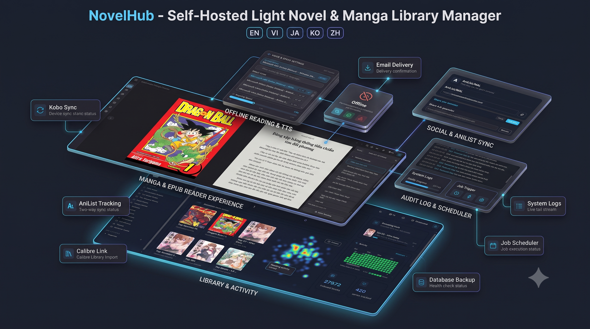

# NovelHub

<p align="center">
  
</p>

Self-hosted, local-first digital book library manager. Organize, read, and manage your entire digital book collection — EPUB, MOBI, PDF, DOCX, FB2, and more — from a single, high-performance web interface.

**Docs:** [English](docs/en/configuration.md) · [Tiếng Việt](docs/vi/configuration.md) · [日本語](docs/ja/configuration.md) · [한국어](docs/ko/configuration.md) · [简体中文](docs/zh/configuration.md)

---

## Features

- **Multi-Format Reader**: Native browser rendering for 25 file extensions (EPUB, KePub, MOBI, AZW3, PDF, DOCX, DOC, ODT, RTF, FB2, CBZ/CBR/CBT/CB7, TXT, MD, HTML). Includes 6 reader themes, 4 page layouts (scroll, single, double, webtoon), custom typography, text highlighting, notes, and Unicode in-book search.
- **Audiobook Support**: Native HTML5 audio streaming for MP3, M4A, M4B, and FLAC (no FFmpeg/HLS dependencies). Features smart chunked streaming to bypass reverse proxy size limits (e.g., Cloudflare).
- **PWA & Offline Reading**: Progressive Web App (PWA) with native installability on iOS, Android, and Desktop (`vite-plugin-pwa`, `workbox`). Allows saving complete books to browser storage for 100% offline reading without network connection, complete with storage quota usage monitoring and auto-update prompts. Permission-gated via `book.offline`.
- **Text-to-Speech (TTS)**: Built-in Text-to-Speech audio reader with voice selection, speech speed control, and active word highlighting. Permission-gated via `book.tts`.
- **Calibre Library Sync**: Complete import & sync from Calibre's `metadata.db` including full metadata (authors, series, publishers, languages, tags, ratings, identifiers, comments).
- **Cross-device Sync & Reading History**: Accurately tracks reading progress (CFI/scroll positions/audio timestamps) across multiple devices in real-time. Includes reading sessions, reading goals, and smart collections.
- **Kobo Sync**: Native Kobo e-reader sync over Wi-Fi (`pkg/kobo`, `pkg/kepub`) — library entitlements, reading state, and on-the-fly KePub conversion. The device authenticates with a per-user path token, so no Kobo account is involved.
- **OPDS 1.2 & 2.0 Server**: Built-in OPDS 1.2 (Atom XML) and OPDS 2.0 (JSON) catalogs at `/api/opds/v1` and `/api/opds/v2/catalog`. Supports full-text search, facet filtering, HTTP Basic Auth, and guest access policies. Seamlessly compatible with mobile reader apps such as KOReader, Moon+ Reader, Calibre, Thorium, Aldiko, and PocketBook.
- **Mihon / Tachiyomi Sync**: Komga-compatible REST API at `/komga/api/v1` (plus `/api/v2` read-progress) that the stock Mihon Komga extension talks to unmodified — series browsing, per-page image serving straight from CBZ/CBR archives, and two-way progress sync via Mihon's built-in tracker. HTTP Basic auth, gated by `komga.sync`.
- **Reading Tracker Sync**: Two-way sync with AniList and MyAnimeList — link a book to an external series and push reading progress automatically.
- **Series Recommendations**: Automatically discovers and displays books in the same series on the book detail page (`SeriesBooksSection`), making it effortless to browse sequential volumes.
- **Email Delivery (SMTP)**: Admin-configured SMTP with STARTTLS / implicit TLS, UI connection testing, configurable max attachment size (`smtp.max_attachment_mb`), and SSRF-safe dialling. Powers Send-to-Kindle (`book.send_email`) and all account email.
- **Account Security**: Email verification and password reset via one-time codes, plus TOTP two-factor authentication with single-use recovery codes. TOTP secrets are encrypted at rest; recovery codes are hashed.
- **Granular Library & Role Permission Policies**: Multi-role security model with 36 granular permissions across reading, personal features, library content, integrations and administration (`book.read`, `book.download`, `book.offline`, `book.tts`, `book.upload`, `book.edit`, `book.delete`, `opds.read`, `kobo.sync`, `calibre.sync`, `library.manage`, `role.manage`, `user.manage`, `setting.manage`, `system.backup`, `webhook.manage`, …). Includes a **Library Scope Selector** UI with mode toggles, searchable multi-select dropdowns, and interactive library chips.
- **Audit Log**: Records administrative actions (settings changes, role edits, bulk operations, restores) with actor attribution, plus a `prune_audit_logs` retention job. Secrets such as the SMTP password are recorded as changed, never by value.
- **Customizable Book Engagement Stats**: Cover engagement metrics (reads, downloads, bookmarks, collections, rating, shares) with per-instance admin visibility selection.
- **Webhooks & Live Builder**: Webhook notifications dispatcher for Discord, Telegram, Slack, and generic HTTP endpoints with HMAC SHA-256 signatures, custom headers, and a live preview builder.
- **Job Scheduler & Queue Engine**: Background job queue (`pkg/worker`) integrated with cron-like job schedule management (`job_schedules`). Supports automated interval execution, manual job triggering, and instant status tracking with singleflight protection and Cache-by-IDs performance.
- **System Logs & Live Tail Viewer**: Real-time log viewer and log tailing engine (`/admin/system/logs`) with log level filtering (`info`, `warn`, `error`), keyword search, and automatic file rotation (`LOG_MAX_SIZE_MB`, `LOG_MAX_FILES`).
- **Database Backup & Staged Restore**: Zero-downtime online database backup system using SQLite Online Backup API. Includes SHA-256 integrity checksum verification, database health check validation, isolated staged restore workflow, and optional process supervisor auto-restart (`RESTORE_AUTO_RESTART`).
- **Duplicate Detection & Management**: SHA-256 file hashing engine to detect and clean up duplicate book files across libraries.
- **High Performance Architecture**: Powered by `theine-go` in-memory RAM caching (Cache-by-IDs pattern for search & random shelves), `singleflight` for thundering-herd protection, and 22 purpose-built SQLite indexes for sub-millisecond query execution.
- **Path Traversal & SSRF Hardened**: Robust security engine featuring socket-level SSRF prevention via `pkg/netx` and `filepath.Rel` path traversal prevention in `pkg/localfs`.
- **Library Management**: Automatic file scanning, cover extraction, metadata editing, tag/author filtering, single-row responsive sliders for Home shelves, and SQLite FTS5 full-text search. A watched inbox (`DATA_DIR/inbox/<libraryID>/`) imports anything dropped into it.
- **Chunked Uploads & Smart GC**: Robust upload system for massive files (bypassing Cloudflare's 100MB body limit) with smart background garbage collection for orphaned uploads using `pkg/worker`.
- **Social Features**: Read and write reviews, rate books, and generate public share links.
- **First-Run Setup Wizard**: Intuitive setup wizard (`/setup`) for admin account creation, branding configuration (Logo & Favicon cropper/fetcher), sidebar navigation toggle, and default feature policy setup.
- **Security & RBAC**: JWT authentication with access + refresh token rotation and instant token version revocation. AES-256-GCM encryption via `pkg/crypto` (`DB_ENCRYPTION_KEY`) for sensitive tokens and credentials stored in SQLite, including tracker tokens, TOTP secrets and the SMTP password.
- **Multi-Language Support**: i18n support with complete, synchronized translation datasets in `web/public/locales/` (`en`, `vi`, `ja`, `ko`, `zh`) with dynamic parameter interpolation (`{{num}}`, etc.).
- **Single Binary Deployment**: The React frontend *and* the SQL schema are embedded in the Go binary — the release artifact is one file with nothing beside it. Zero-config SQLite (`modernc.org/sqlite`) with WAL mode and MMAP; the schema is applied on first launch.

---

## Quick Start

### Docker

```bash
cp .env.example .env
openssl rand -hex 32   # three times — one per secret in .env
docker compose up -d
```

### Run Locally

```bash
cp .env.example .env
make run
```

Open `http://127.0.0.1:3434`. The Setup Wizard (`/setup`) runs on first launch
and creates the root administrator.

Behind a reverse proxy, add `TRUST_PROXY=true` to `.env` and forward
`X-Forwarded-For` and `X-Forwarded-Proto` — see
[Reverse Proxy](docs/en/reverse-proxy.md). The compose file already defaults it to
`true`; set `TRUST_PROXY=false` if you publish the port straight to the internet
with no proxy in front, or clients can forge those headers.

---

## Development

```bash
# Frontend dev (port 5173 with Bun)
cd web && bun install && bun run dev

# Backend dev
go run ./cmd/api
```

### Make Targets

| Target | Description |
|---|---|
| `make run` | Build frontend with Bun and start Go server |
| `make test` | Run all Go unit tests |
| `make sqlc` | Regenerate SQLC database models |
| `make check` | Run full verification (sqlc + tests + web-build + go build) |

---

## Project Structure

```
novelhub/
├── AGENTS.md            # Architecture rules for AI coding agents
├── cmd/api/             # Application entry point & embedded web UI
├── internal/
│   ├── controllers/     # Fiber v3 HTTP handlers & DTO validation
│   ├── dtos/            # Request / Response payload definitions
│   ├── gen/sqlc/        # Type-safe generated database code
│   ├── middlewares/     # JWT auth, RBAC permissions, rate limit, body limit
│   ├── models/          # Domain entities (FromSqlc / ToResponse helpers)
│   ├── repositories/    # Persistence layer with RAM Cache-by-IDs pattern
│   ├── routes/          # Route registration & per-route middleware wiring
│   └── services/        # Domain business logic & multi-format parsers
├── pkg/
│   ├── apperrors/       # Application error definitions
│   ├── bookparser/      # Format parser engines (EPUB, MOBI, PDF, FB2, etc.)
│   ├── cache/           # In-memory RAM cache (`theine-go`) & key builders
│   ├── calibre/         # Calibre metadata.db import engine
│   ├── config/          # Environment variable access with defaults
│   ├── constants/       # Cache keys, TTLs, limits, permission constants
│   ├── convert/         # ID parsing, null conversion & cursor helpers
│   ├── crypto/          # AES-256-GCM encryption for stored credentials
│   ├── database/        # SQLite pragmas, schema apply & TxManager
│   ├── jsonx/           # High-performance JSON engine (sonic with std fallback)
│   ├── kepub/           # EPUB to KePub conversion for Kobo devices
│   ├── kobo/            # Kobo sync protocol types & constants
│   ├── localfs/         # Path traversal prevention using SafeJoin & filepath.Rel
│   ├── logging/         # Structured logging with file rotation
│   ├── mailer/          # SMTP delivery with STARTTLS / implicit TLS
│   ├── netx/            # SSRF-safe HTTP client with IP validation
│   ├── opds/            # OPDS 1.2 / 2.0 feed types
│   ├── systemgate/      # Startup gating for staged database restores
│   ├── totp/            # TOTP two-factor authentication
│   ├── validator/       # DTO struct validation engine
│   └── worker/          # Bounded background worker pool
├── db/
│   ├── embed.go         # //go:embed schema/*.sql — schema ships in the binary
│   ├── schema/          # SQLite schema, applied on first launch
│   └── query/           # Type-safe SQLC query definitions (explicit column projections)
└── web/                 # React 19 + Vite + TailwindCSS + DaisyUI (Bun)
    ├── public/locales/  # i18n translation datasets (en, vi, ja, ko, zh)
    └── src/             # Components, Pages, Services, Stores (Zustand)
```

The project is not yet public, so `db/schema/` carries no migration history: schema files are
edited in place and the database is recreated. Because the schema is embedded at compile time,
a missing schema file is a build error rather than a runtime failure on someone else's machine.

---

## Configuration

Four environment variables matter — three secrets and one proxy setting.
Everything else auto-tunes or is configured in the admin UI.

```bash
cp .env.example .env
openssl rand -hex 32   # run three times, one per secret
```

| Variable | Description |
|---|---|
| `JWT_SECRET` | **Required.** Signs access tokens |
| `JWT_REFRESH_SECRET` | **Required.** Signs refresh tokens |
| `DB_ENCRYPTION_KEY` | **Required.** Encrypts tracker tokens, TOTP secrets and the SMTP password stored in the database |
| `TRUST_PROXY` | `false` when run directly, `true`, or a list of proxy IPs/CIDRs. Set when behind nginx/Caddy/Cloudflare. The Docker compose file defaults it to `true` |

Site identity, server URL, registration, guest access, permissions, SMTP,
trackers, upload limits and rate limits are all set in the setup wizard and admin
Settings — not in `.env`.

Full reference: **[Configuration](docs/en/configuration.md)** ·
**[Deployment](docs/en/deployment.md)** ·
**[Reverse Proxy](docs/en/reverse-proxy.md)**

Other languages: [Tiếng Việt](docs/vi/configuration.md) ·
[日本語](docs/ja/configuration.md) ·
[한국어](docs/ko/configuration.md) ·
[简体中文](docs/zh/configuration.md)

---

## Supported Formats

| Format | Extensions | Reader | Metadata | Cover |
|---|---|---|---|---|
| EPUB / KePub | `.epub`, `.kepub.epub` | ✅ HTML | ✅ | ✅ |
| MOBI / AZW3 | `.mobi`, `.azw`, `.azw3`, `.amz` | ✅ HTML | ✅ | ✅ |
| Audiobooks | `.mp3`, `.m4a`, `.m4b`, `.flac` | ✅ Audio | ✅ | ❌ |
| PDF | `.pdf` | ✅ Native | ⚠️ Basic | ❌ |
| DOCX / DOC | `.docx`, `.doc` | ✅ HTML | ✅ | ❌ |
| ODT | `.odt` | ✅ HTML | ✅ | ❌ |
| RTF | `.rtf` | ✅ HTML | ⚠️ Basic | ❌ |
| FB2 | `.fb2` | ✅ HTML | ✅ | ✅ |
| HTML | `.html`, `.htm` | ✅ HTML | ⚠️ Basic | ❌ |
| Comics | `.cbz`, `.cbr`, `.cbt`, `.cb7` | ✅ Images | ⚠️ Basic | ❌ |
| Archived books | `.zip`, `.fbz` | ✅ HTML | ⚠️ Basic | ❌ |
| Plain Text / MD | `.txt`, `.md`, `.markdown` | ✅ HTML | ⚠️ Basic | ❌ |

---

## License

MIT
